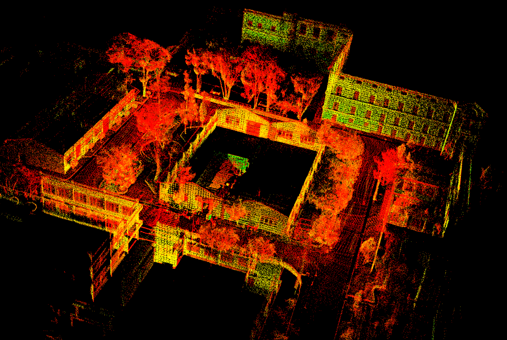

# Auto_NAV-FYP
This repository contains the code and documentation for our Final Year Project on Autonomous Navigation. The project focuses on developing a autonomous system that is capable of autonomous movement inside the campus environment.

The demostration of our autonomous system shown below: 
<!-- 

  

 -->

  

### System Requirements (For Development/Implementation)

#### Hardware Requirements

The following hardware components are required for the successful development and implementation of the project:

1. DC Motor  
2. Motor Driver  
3. STM32f4 Discovery  
4. Encoders  
5. Laptop  
6. Mid-360 LiDAR  
7. Battery  

#### Software Requirements

The software required for the project includes:

1. SolidWorks  
2. ROS2 (Humble)  
3. VSCode  
4. STMCubeMX  
5. OpenCV  

### Map Overlay of Robotics Club and PCD of the Environment

The following images show key components of our autonomous navigation system. On the left, you can see the map overlay of the Robotics Club, which outlines the environment. On the right, we have the Point Cloud Data (PCD) image, which is crucial for understanding the surroundings for real-time navigation.

<table>
  <tr>
    <td>
      <strong>PCD of the Environment</strong> 
      
    </td>
    <td>
      <strong>Map Overlay of Robotics Club</strong> 
      
    </td>
  </tr>
</table>

##### Acknowledgments:
We would like to express our sincere gratitude to the following individuals for their invaluable contributions and support:

###### Supervisors:
Prof. Dr. Laxman Poudel
Asst. Prof. Ashish Karki
Asst. Prof. Biman Rimal

###### Seniors:
1. Ankit Kharel, Anusha Acharya, Nitesh Subedi, and Prajwal Koirala (2074/BME): For laying the foundation for the trajectory optimization of autonomous navigation of two-wheeled robots.

2. Nirmal Prasad Panta, Pawan Shrestha, Prince Panta, and Saki Basnet (2076/BME): For their valuable insights and foundational contributions to the indoor navigation of two-wheeled robots, which have greatly inspired and supported our efforts.

#### Note:
I am currently in the process of refining and cleaning the code, as well as enhancing the documentation, before uploading the final version to the repository. If you require any additional information or have any questions, please feel free to contact me at the following email addresses: official.biswash0716@gmail.com : 077bme014.biswash@pcampus.edu.np
